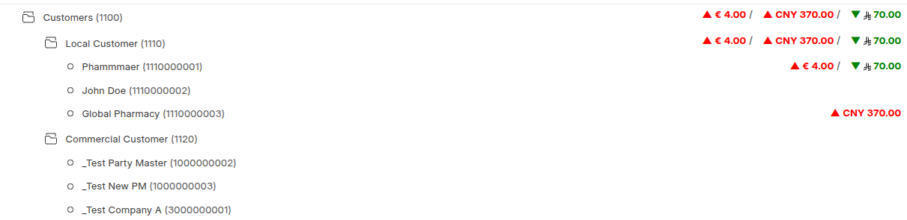

# Unified Party Hub (UPH)

<div align="center">
  <a href="https://github.com/Sendipad/uph/wiki">
    
  </a>
  <p>A Foundational and Scalable Master Data Management Solution for ERPNext</p>

  <!-- Version/Compatibility Badge -->
  
  <br>

  <!-- Action Badges -->
  <a href="https://github.com/Sendipad/uph#installation">
    
  </a>
  &nbsp;
  <a href="https://github.com/Sendipad/uph/wiki">
    
  </a>
</div>

---

## 🖼 Screenshots & Demo

<p align="center">
  
</p>

<p align="center">
  
</p>

---

## 🌟 Overview
UPH is a mission-critical Frappe application solving **Master Data Management (MDM) challenges** in ERPNext.  
It provides a **single source of truth** for all business entities (Customers, Suppliers, Employees, Shareholders), enabling multi-role management, consolidated reporting, and zero data duplication.

Built on Frappe (Python, JavaScript, Vue) for **extensibility and enterprise readiness**.

**Other Languages:**  
- [Arabic (العربية)](README.ar.md) 🇸🇦

---

## 💡 The Problem UPH Solves
Standard ERPNext treats Customers, Suppliers, and Employees as separate entities, which causes:

- **Data Duplication:** A single entity with multiple roles requires separate, unlinked records.  
- **Consolidation Complexity:** Multi-currency consolidated reports are difficult or impossible.  
- **Lack of Hierarchy:** No native mechanism for parent-subsidiary organization.  
- **Limited Flexibility:** Extending party roles to vertical domains (Schools, Healthcare) is cumbersome.

---

## ✅ Key Features

### 1. Unified Party Master (Tree Doctype)
- **Single Unified Doctype:** Controls creation, fetching, and linking of all related entities.  
- **Zero Duplication:** Minimizes duplicate party records.  
- **Tree Hierarchy:** Multi-level organizational grouping for accurate reporting.

### 2. Dynamic Role & Integration Flexibility
- **Multi-Role Party:** Enable multiple roles per Party Master.  
- **Flexible Integration:** Works with standard and custom ERPNext party types.  
- **Easy UI/Migration:** Intelligent backend queries and UI simplify linking existing records.

### 3. Advanced Financial & Data Control
- **Multi-Currency Support:** Consolidated reporting and balance tracking.  
- **Centralized Control:** Manage relationships, defaults, and configurations in one place.

---

## 🔧 Future Vision: Hub Module (Rule Engine)
The **Hub module** is under development as a **flexible rule engine** providing:

- **Deduplication Enforcement**  
- **Integrity Validation**  
- **Dynamic Data Population**  
- **Custom Rule Services** for developers to create specialized workflow rules.

---

## 🚀 Usage

### Installation
```bash
bench get-app unified_party_hub https://github.com/Sendipad/uph
bench install-app uph
```
### Next Steps

1. Navigate: Unified Party Hub → Party Master in ERPNext v15+.


2. Define your Party Master hierarchy.


3. Link existing Customers/Suppliers/Employees or create new linked doctypes.


4. Explore consolidated reports, multi-currency tracking, and hierarchical analytics.


---

🎯 Call to Action

UPH is more than a feature—it’s a fundamental architectural improvement.

Benefits for ERPNext core:

Native multi-role support

Eliminates duplicate records

Enterprise-grade MDM with hierarchical and consolidated reporting


We welcome feedback and collaboration to align UPH with ERPNext core standards.


---

💼 Use Cases

Group-level financial consolidation

Hierarchical sales/procurement reporting

Mapping relationships among business units, employees, shareholders

Departmental or regional party organization


---

📜 License

Licensed under GNU General Public License v3.0.
Free to use, extend, and contribute.

---
