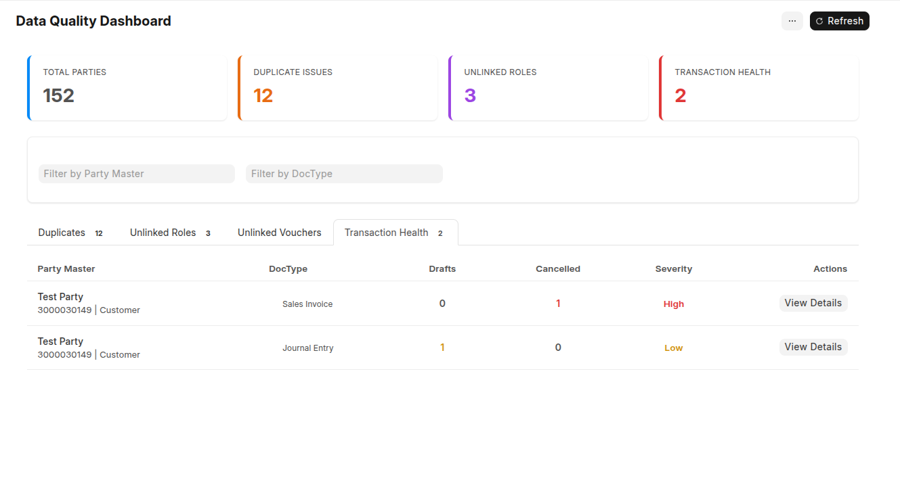
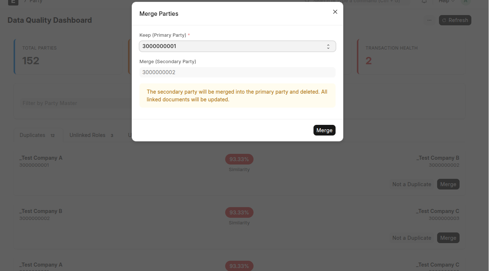
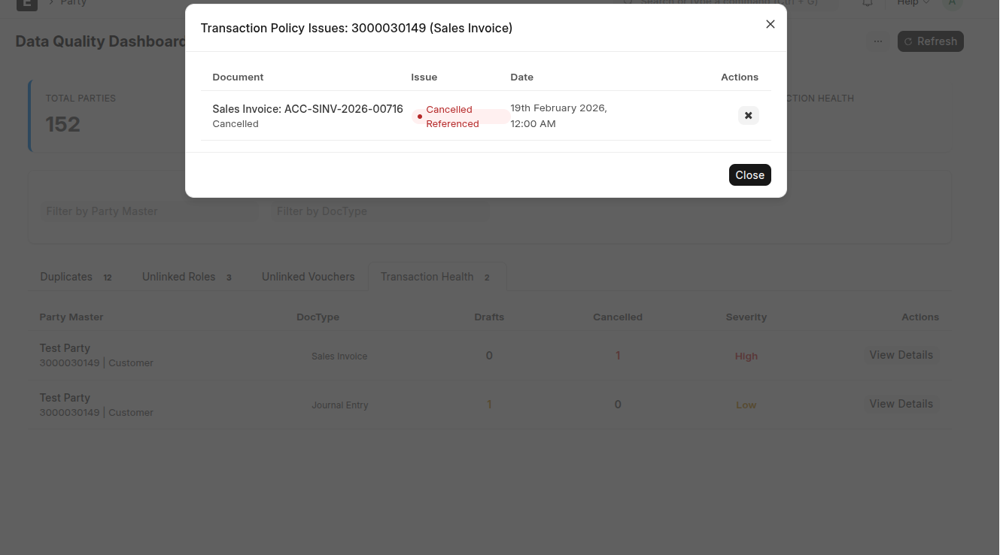
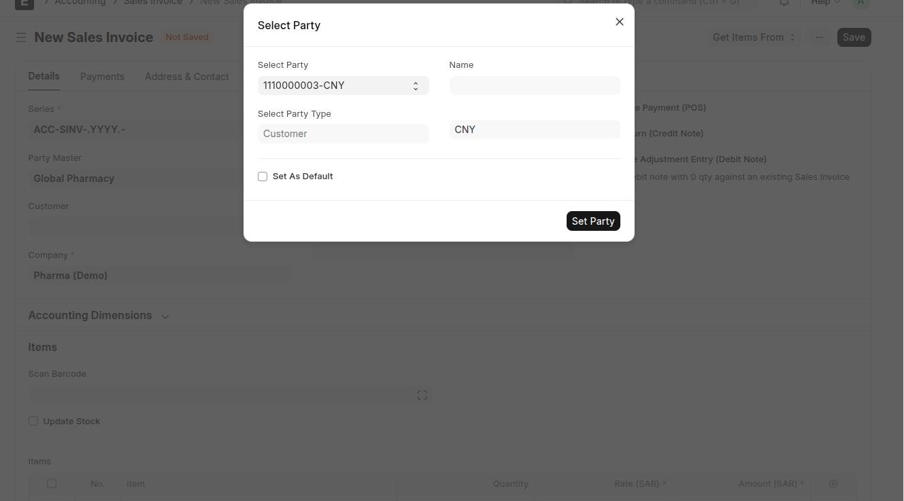

<div align="center">
  <a href="https://github.com/Sendipad/uph">
    
  </a>
  <h3> Unified Party Hub (UPH) for Frappe/ERPNext</h3>
 <h4>Master Data Management (MDM) for Frappe/ERPNext</h4>
  
  <p><b>Centralize. Unify. Govern.</b></p>

&query=count&url=https://raw.githubusercontent.com/Sendipad/uph/stats/clones.json)
&query=uniques&url=https://raw.githubusercontent.com/Sendipad/uph/stats/clones.json)
  [](https://github.com/Sendipad/uph/actions/workflows/ci.yml)
  [](https://github.com/Sendipad/uph/actions/workflows/ci.yml)
  [](https://github.com/Sendipad/uph/actions/workflows/ci.yml)
  <br>
  
  
  
  <br><br>

  <a href="#overview">Overview</a> •
  <a href="#core-doctypes">Core DocTypes</a> •
  <a href="#reports">Reports</a> •
  <a href="#pages">Pages</a> •
  <a href="#features">Features</a> •
  <a href="#architecture">Architecture</a> •
  <a href="#installation">Installation</a>
</div>

---

## 🖼️ Visual Insights

<p align="center">
  

  <br>
  <i>Advanced Tree Hierarchy providing consolidated financial visibility at every node.</i>
</p>

### Party Workspace
<p align="center">
  

  <br>
  <i>Centralized Party Workspace for unified management and reporting.</i>
</p>

### Data Quality & Governance
<div align="center">
  


  
  <br>
  <i>Real-time insights into data quality, duplicates, and transactional health.</i>
</div>

### Conflict Resolution
<div align="center">
  
  
  <br>
  <i>Intuitive conflict resolution screens for unlinked roles and duplicate exclusion.</i>
</div>

### Smart Linking
<p align="center">
  
  <br>
  <i>Fuzzy matching and Smart Linking interface to easily assign ERPNext parties to their Master Entity.</i>
</p>

---

# Unified Party Hub (UPH)

**Unified Party Hub (UPH)** is an enterprise-grade Master Data Management (MDM) extension for ERPNext. It centralizes siloed business roles (Customers, Suppliers, Employees) into a unified, tree-based hierarchy, providing consolidated financial visibility and rigorous data governance across complex business ecosystems.

> **Target users:** ERPNext implementers who need a single, governed entity for parties that can act as customer, supplier, employee, etc.

## Overview

Standard ERPNext implementations often face challenges when managing complex business entities:

- **Fragmented Identity**: A single legal entity acting as both a Customer and a Supplier exists as two disconnected documents.
- **Multi-Currency Logic**: Transacting with the same party in multiple currencies often requires creating duplicate party records (e.g., "Customer USD", "Customer EUR") to map to specific Receivable/Payable accounts.
- **Siloed Reporting**: Financial reports (General Ledger, Aging) are segmented by the specific Party record, making it difficult to get a 360-degree view of the legal entity's total exposure.
- **Data Redundancy**: Address and Contact data must be duplicated across multiple party roles.

UPH solves these problems by introducing the **Party Master** - a central governance layer that sits above standard ERPNext Party types.

---

## v3 Update Notes (Merge Confirmation)

### ✅ Migration Patch Included

The v3 merge includes a post-model migration patch:

- `uph.patches.migrate_duplicate_exclusion_to_party_issue`

This patch migrates legacy **Duplicate Exclusion** records into **Party Issue** records and maps legacy statuses (`Detected`, `Dismissed`, `Merged`) into the new issue workflow states (`Open`, `Ignored`, `Resolved`).

### New UX/UI Additions in v3

- **UPH Setup Wizard** (`uph-setup-wizard`) for first-run setup, language/template selection, numbering rules, and safe seeding options.
- **Auto-redirect guard** for Administrator/System Manager to enforce setup completion before using core UPH forms/tree views.
- **Data Quality Dashboard UX expansion** with dedicated tabs for Duplicate Issues, Unlinked Roles, Unlinked Vouchers, and Transaction Health.

### Key Feature Fixes/Enhancements in v3

- Unified governance model using **Party Issue** as the operational issue registry.
- Duplicate scanning with normalized fuzzy matching and queue-based execution.
- Unlinked role resolution with suggestion-based linking and create-from-role flow.
- Transaction policy checks for draft aging, cancelled-unamended detection, and party-master mismatch analysis.

---

## Quick Start

> **Prerequisites:** Frappe/ERPNext v15+ and a working bench site.

### Getting Started: Prevent Customer/Supplier Name Overwrites

If you want to stop `customer_name` / `supplier_name` from changing after a rename, pick one:

1. Change ERPNext naming settings  
Set “Customer Naming By” to `Naming Series` in **Selling Settings**.  
Set “Supplier Naming By” to `Naming Series` in **Buying Settings**.  
This prevents `after_rename` from overwriting `customer_name` / `supplier_name`.

2. Code override (UPH)  
Implement a small hook to skip updating `customer_name` / `supplier_name` during rename events. If you want this pattern in-core, open an issue or PR and reference your expected behavior.

```bash
# Install app
bench get-app https://github.com/Sendipad/uph
bench --site {your-site} install-app uph

# Migrate to apply fixtures and setup
bench --site {your-site} migrate
```

After install, open **Party Master Settings** and review:
- Party type rules
- Doctype mappings for transactional documents
- Duplicate voucher prevention rules

---

## Core DocTypes

UPH introduces the following DocTypes to manage party data:

### 1. Party Master ([`Party Master`](uph/party/doctype/party_master/party_master.json))
The central hub for all party entities. Key features:
- **Tree-based Hierarchy**: Supports parent-child relationships for organizational structures
- **Hierarchical Numbering**: Automatic numbering based on parent node
- **Multi-Role Support**: Link Customers, Suppliers, Employees under one entity
- **Legal Identity**: Tax ID, registration numbers, legal entity types
- **Contacts & Addresses**: Centralized contact and address management
- **Primary/Secondary Roles**: Define primary role and link secondary roles
- **Internal Party**: Mark as internal party for inter-company transactions

### 2. Party Analytic Accounting ([`Party Analytic Accounting`](uph/party/doctype/party_analytic_accounting/party_analytic_accounting.json))
Enables Oracle TCA-like site accounting. Features:
- **Accounting Non-Duplication**: Eliminates redundant accounts for branches
- **Multiple Dimension Types**: Site, Business Unit, Branch, Territory, Cost Center, Factory/Plant
- **Company-Specific Rules**: Configure rules per company
- **Effective Dating**: Track validity periods for accounting dimensions
- **Allow/Restrict Rules**: Control which parties can use specific dimensions

### 3. Party Master Parties ([`Party Master Parties`](uph/party/doctype/party_master_parties/party_master_parties.json))
Junction table linking Party Master to ERPNext parties:
- **Dynamic Links**: Links to Customer, Supplier, Employee, Shareholder
- **Currency Tracking**: Track currency per linked party
- **Party Name**: Reference to the linked party name

### 4. Party Master Settings ([`Party Master Settings`](uph/party/doctype/party_master_settings/party_master_settings.json))
Central configuration for UPH:
- **Party Type Rules**: Configure uniqueness rules per party type
- **DocType Mapping**: Inject party_master field into transactional documents
- **Field Synchronization**: Sync fields between Party Master and linked parties
- **PAA Configuration**: Enable and configure Party Analytic Accounting
- **Tree View Settings**: Auto-expand levels, hide balance
- **Duplicate Voucher Check**: Prevent duplicate vouchers for same Party Master

### 5. Party Relationship ([`Party Relationship`](uph/party/doctype/party_relationship/party_relationship.json))
Define N-to-N relationships between parties:
- **Relationship Types**: Parent/Subsidiary, Ownership, Management
- **Ownership Percentages**: Track ownership stakes
- **Validity Periods**: Define relationship effective dates
- **Party Relationship Type**: Configure relationship type master data

### 6. Duplicate Exclusion ([`Duplicate Exclusion`](uph/party/doctype/duplicate_exclusion/duplicate_exclusion.json))
Rules for excluding duplicates:
- **Exclusion Criteria**: Define rules to ignore certain duplicates
- **Document Types**: Apply rules to specific doctypes

### 7. Party Issue ([`Party Issue`](uph/party/doctype/party_issue/party_issue.json))
Unified governance issue registry introduced in v3:
- **Issue Types**: Duplicate, Unlinked, Health, Transaction Policy
- **Workflow States**: Open, Under Review, Resolved, Ignored
- **Operational Metadata**: score, source engine, references, JSON details
- **Migration Target**: receives migrated records from legacy Duplicate Exclusion patch

---

## Key Workflows

### 1) Create a Party Master
1. Create a new **Party Master**.
2. Set **Party Type**, legal identity fields, and (optionally) hierarchy parent.
3. Link existing parties (Customer/Supplier/Employee) or create new ones.

### 2) Link Existing Parties
Use **Party Master > Parties** to link existing parties to a single entity. The system enforces:
- Role rules (primary/secondary).
- Duplicate constraints from **Party Master Settings**.

### 3) Transactional Validation
- Transactional documents mapped in **Party Master Settings** will validate or auto‑set `party_master`.
- Party Analytic Accounting (PAA) validation will enforce Party Master consistency.

### Supporting DocTypes
- [`Party Master Accounts`](uph/party/doctype/party_master_accounts/party_master_accounts.json): Account mappings per party
- [`Party Master Role`](uph/party/doctype/party_master_role/party_master_role.json): Role definitions
- [`Party Analytic Accounting Party`](uph/party/doctype/party_analytic_accounting_party/party_analytic_accounting_party.json): PAA party assignments
- [`Party Analytic Accounting Allowed Company`](uph/party/doctype/party_analytic_accounting_allowed_company/party_analytic_accounting_allowed_company.json): Company permissions for PAA
- [`Party Master Settings DocType`](uph/party/doctype/party_master_settings_doctype/party_master_settings_doctype.json): DocType configuration
- [`Party Master Settings DocField`](uph/party/doctype/party_master_settings_docfield/party_master_settings_docfield.json): Field mapping configuration
- [`Party Master Settings Party Type`](uph/party/doctype/party_master_settings_party_type/party_master_settings_party_type.json): Party type rules configuration

---

## Reports

UPH provides comprehensive reporting capabilities:

### 1. Party Master Ledger ([`Party Master Ledger`](uph/party/report/party_master_ledger/party_master_ledger.json))
Consolidated ledger view across all linked parties:
- Filter by Party Master, party type, company, date range
- View all transactions under a single Party Master
- Consolidated totals across linked parties

### 2. Party Account Balances ([`Party Account Balances`](uph/party/report/party_account_balances/party_account_balances.json))
Account balance reporting per party:
- Receivable/Payable balances
- Currency-wise breakdown
- Aging analysis

### 3. Party Accounting Ledger ([`Party Accounting Ledger`](uph/party/report/party_accounting_ledger/party_accounting_ledger.json))
Detailed accounting transactions:
- Filter by Party Master and accounting dimension
- Voucher-wise details
- Debit/Credit summaries

### 4. Party Ledger ([`Party Ledger`](uph/party/report/party_ledger/party_ledger.json))
Standard party ledger with Party Master integration:
- Enhanced with Party Master link
- Extended filtering options

### 5. Chronological Party Ledger ([`Chronological Party Ledger`](uph/party/report/chronological_party_ledger/chronological_party_ledger.json))
Time-based party transaction history:
- Chronological transaction listing
- Date-wise summaries
- Transaction type filtering

### 6. Party Account Statement ([`Party Account Statement`](uph/party/report/party_account_statement/party_account_statement.json))
Customer/statement-style reporting:
- Statement format output
- Balance confirmation ready
- Transaction details with running balance

### 7. Party Master Health Report ([`Party Master Health Report`](uph/party/report/party_master_health_report/party_master_health_report.json))
Data quality and governance reporting:
- Linkage status
- Missing tax IDs
- Unlinked parties
- Data completeness metrics

---

## Configuration Notes

### Party Master Settings (Core)
- **DocType Mapping:** Determines which transactional documents require `party_master`.
- **Party Type Rules:** Defines required/unique fields per party type.
- **Duplicate Voucher Check:** Prevents duplicate vouchers for the same Party Master.

### Party Analytic Accounting (Optional)
- If enabled, PAA enforces accounting dimension consistency for linked parties.

---

## Pages

### 1. Data Quality Dashboard ([`Data Quality Dashboard`](uph/party/page/data_quality_dashboard/data_quality_dashboard.json))
Real-time data quality monitoring:
- **Governance Score**: Overall data quality metric
- **Linkage Statistics**: Linked vs unlinked parties
- **Duplicate Detection**: Potential duplicates identification
- **Tax ID Compliance**: Missing tax ID tracking
- **Quick Actions**: Link parties, merge duplicates, create exclusions

### 2. UPH Setup Wizard ([`UPH Setup Wizard`](uph/party/page/uph_setup_wizard/uph_setup_wizard.json))
Guided onboarding flow for v3:
- **First-Run Detection**: Blocks incomplete setup for privileged users
- **Language & Template Selection**: Seeds initial party structure from templates
- **Governance Setup**: Numbering format, group/leaf digits, uniqueness/sync toggles
- **Safe Seeding Mode**: Skip, merge/update, or strict fresh-seed behavior when data exists

---

## Features

### 🛡️ Party Identity Governance
- Real-time governance score tracking
- Linkage statistics and visualization
- Smart duplicate detection using fuzzy matching
- Tax ID validation and compliance tracking

### 🚀 Production-Ready Onboarding
- Smart linking dialog for bulk association
- "Create Party As" wizard for instant role provisioning
- Automatic inheritance of address, contact, and tax data
- Bulk migration support for existing parties

### 💱 Hierarchical Multi-Currency Support
- Define group accounts at Party Master level
- Automatic hierarchy traversal for currency matching
- Single party entity with multi-currency transactions
- Correct GL mapping per currency

### ⚡ High-Performance Architecture
- **SmartCache**: Redis-based caching layer
- **Batched Processing**: Optimized SQL queries
- **Request Scoping**: Local cache per request
- **Query Builder**: Uses frappe.qb for efficiency

### 📊 Party Analytic Accounting
- Oracle TCA-like site accounting
- Multiple dimension types (Site, Branch, Territory, etc.)
- Company-specific rules
- Allow/Restrict functionality
- Effective dating support

### 🌳 Tree-Based Hierarchy
- Parent-child organizational structures
- Consolidated balance visibility at every level
- Hierarchical numbering system
- Automatic cascading updates

### 🔗 Relationship Management
- Parent/Subsidiary structures
- Ownership percentages and validity
- Advanced N-to-N relationship mapping
- Relationship type configuration

### 📋 Configuration
- Dynamic field injection into DocTypes
- Per-party-type uniqueness rules
- Validation rules and mandatory fields
- Field synchronization settings

---

## Architecture

UPH is built as a non-intrusive extension to ERPNext:

### Core Components

```mermaid
graph TD
    PM[Party Master] -->|Links| PMP[Party Master Parties]
    PMP -->|Maps to| C[Customer]
    PMP -->|Maps to| S[Supplier]
    PMP -->|Maps to| E[Employee]
    
    PM -->|Parent| PM_Group[Party Group]
    
    PM -->|Configured by| PMS[Party Master Settings]
    
    subgraph "Financials"
    C -.->|GL Entry| GL[General Ledger]
    S -.->|GL Entry| GL
    GL -->|Consolidated| Report[Party Master Ledger]
    end
    
    subgraph "Party Analytic Accounting"
    PAA[Party Analytic Accounting] -->|Tags| TRANS[Transactions]
    PAA -->|Segments| Report
    end
    
    subgraph "Data Quality"
    DQ[Data Quality Dashboard] -->|Monitors| PM
    DQ -->|Detects| Duplicates[Potential Duplicates]
    end
```



### Key Implementation Details

1. **Hooks & Events**: Intercepts `validate`, `on_update`, and `on_trash` events for data integrity
2. **Dynamic Field Injection**: Uses `Party Master Settings` to inject Link fields without schema modifications
3. **Override Methods**: Extends `erpnext.accounts.party.get_party_details` for unified data retrieval
4. **Smart Validation**: Optimized hooks with early-exit for performance

### Supported Transactional Documents

UPH automatically injects Party Master into these documents:
- Sales Invoice / Sales Invoice Item
- Purchase Invoice / Purchase Invoice Item
- Journal Entry / Journal Entry Account
- Payment Entry
- Sales Order / Sales Order Item
- Purchase Order / Purchase Order Item
- Delivery Note / Delivery Note Item
- Purchase Receipt / Purchase Receipt Item
- Expense Claim

---

## API Reference

### Backend Controllers

| Function | Path | Description |
|----------|------|-------------|
| `validate_party_master_on_document_types_smart` | [`uph.party.controllers.party`](uph/party/controllers/party.py) | Smart validation with early-exit optimization |
| `validate_party_master_on_target_party_type_smart` | [`uph.party.controllers.party`](uph/party/controllers/party.py) | Validates Customer/Supplier/Employee |
| `get_party_details` | [`uph.party.controllers.party`](uph/party/controllers/party.py) | Overrides ERPNext party details API |
| `normalize_text` | [`uph.party.controllers.normalization`](uph/party/controllers/normalization.py) | Text normalization for fuzzy matching |
| `validate_document_quality` | [`uph.party.controllers.mdm`](uph/party/controllers/mdm.py) | Data quality validation |
| `party_master_link_query` | [`uph.party.controllers.queries`](uph/party/controllers/queries.py) | Optimized link query with ranking |

---

## Compatibility

| Component | Version |
|-----------|---------|
| Framework | Frappe Framework v15+ |
| ERP | ERPNext v15+ |
| Database | MariaDB / PostgreSQL |
| Python | 3.10+ |

---

## Use Cases

1. **Conglomerates**: Manage inter-company transactions where a subsidiary is both a vendor and a client
2. **Multi-National Trade**: Handle single customers paying in multiple currencies without cluttering the Customer master
3. **Governance Compliance**: Enforce strict Tax ID validation and prevent duplicate customer creation
4. **Branch Accounting**: Track financial performance by branch/site without creating separate Customer/Supplier records
5. **Relationship Mapping**: Define complex corporate hierarchies and ownership structures

---

## Installation

### Via Bench (Recommended)

```bash
bench get-app https://github.com/Sendipad/uph.git
bench install-app uph
bench migrate
```

### Manual Installation

1. Clone the repository into your apps directory:
   ```bash
   cd ~/frappe-bench/apps
   git clone https://github.com/Sendipad/uph.git
   ```

2. Install the app:
   ```bash
   bench install-app uph
   bench migrate
   ```

3. Clear cache:
   ```bash
   bench clear-cache
   ```

---

## Documentation

Full documentation is available at: [https://sendipad.github.io/uph/](https://sendipad.github.io/uph/)

### Quick Start Guide

1. **Configure Party Master Settings**: Set up which party types to manage
2. **Create Party Master Hierarchy**: Build your organizational structure
3. **Link Existing Parties**: Use Smart Linking to associate existing customers/suppliers
4. **Configure PAA**: Set up Party Analytic Accounting dimensions
5. **Verify Reports**: Run Party Master Ledger to confirm consolidated data

---

## License

This project is licensed under the GPL-3.0 License - see the [LICENSE](license.txt) file for details.

---

## Support

- **GitHub Issues**: Report bugs and request features
- **Documentation**: [https://sendipad.github.io/uph/](https://sendipad.github.io/uph/)
- **ERPNext Community**: [https://discuss.erpnext.com](https://discuss.erpnext.com)
  

---

<div align="center">
  <sub>Built with ❤️ for the ERPNext Community</sub>
</div>
