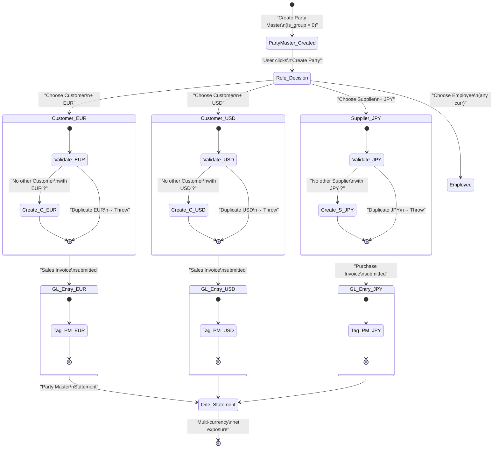

* Architecture Deep-Dive * \
** Entity Relationship ** \

```mermaid
stateDiagram-v2
    [*] --> PartyMaster_Created : "Create Party Master\n(is_group = 0)"
    
    PartyMaster_Created --> Role_Decision : "User clicks\n'Create Party'"

    state Role_Decision <<choice>>
    Role_Decision --> Customer_EUR : "Choose Customer\n+ EUR"
    Role_Decision --> Customer_USD : "Choose Customer\n+ USD"
    Role_Decision --> Supplier_JPY : "Choose Supplier\n+ JPY"
    Role_Decision --> Employee : "Choose Employee\n(any curr)"

    state Customer_EUR {
        [*] --> Validate_EUR
        Validate_EUR --> Create_C_EUR : "No other Customer\nwith EUR ?"
        Create_C_EUR --> [*]
        Validate_EUR --> [*] : "Duplicate EUR\n→ Throw"
    }

    state Customer_USD {
        [*] --> Validate_USD
        Validate_USD --> Create_C_USD : "No other Customer\nwith USD ?"
        Create_C_USD --> [*]
        Validate_USD --> [*] : "Duplicate USD\n→ Throw"
    }

    state Supplier_JPY {
        [*] --> Validate_JPY
        Validate_JPY --> Create_S_JPY : "No other Supplier\nwith JPY ?"
        Create_S_JPY --> [*]
        Validate_JPY --> [*] : "Duplicate JPY\n→ Throw"
    }

    %% GL tagging happens automatically
    Customer_EUR --> GL_Entry_EUR : "Sales Invoice\nsubmitted"
    Customer_USD --> GL_Entry_USD : "Sales Invoice\nsubmitted"
    Supplier_JPY --> GL_Entry_JPY : "Purchase Invoice\nsubmitted"

    state GL_Entry_EUR {
        [*] --> Tag_PM_EUR
        Tag_PM_EUR --> [*]
    }
    state GL_Entry_USD {
        [*] --> Tag_PM_USD
        Tag_PM_USD --> [*]
    }
    state GL_Entry_JPY {
        [*] --> Tag_PM_JPY
        Tag_PM_JPY --> [*]
    }

    %% Final aggregated state
    GL_Entry_EUR --> One_Statement : "Party Master\nStatement"
    GL_Entry_USD --> One_Statement
    GL_Entry_JPY --> One_Statement

    One_Statement --> [*] : "Multi-currency\nnet exposure"
```
