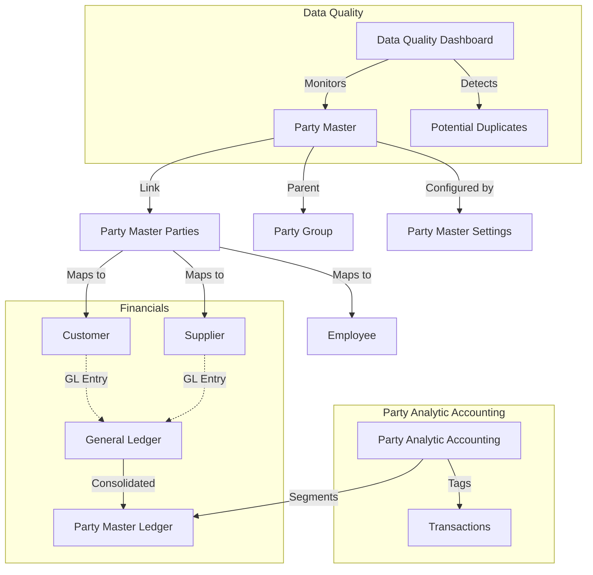

# Unified Party Hub (UPH)

**Enterprise-Grade Master Data Management (MDM) for ERPNext**

Unified Party Hub (UPH) is a comprehensive Master Data Management (MDM) extension for ERPNext that centralizes siloed business roles (Customers, Suppliers, Employees) into a unified, tree-based hierarchy. It provides consolidated financial visibility and rigorous data governance across complex business ecosystems.

---

## Why UPH?

### The Problem

Standard ERPNext implementations often face challenges when managing complex business entities:

| Problem | Description | Impact |
|---------|-------------|--------|
| **Fragmented Identity** | A single legal entity acting as both a Customer and a Supplier exists as two disconnected documents | Difficulty tracking total relationship |
| **Multi-Currency Logic** | Transacting with the same party in multiple currencies often requires creating duplicate party records | Cluttered Customer/Supplier masters |
| **Siloed Reporting** | Financial reports are segmented by the specific Party record | No 360-degree view of legal entity |
| **Data Redundancy** | Address and Contact data must be duplicated across multiple party roles | Data inconsistency risks |

### The Solution

UPH introduces the **Party Master**, a central governance layer that sits above standard ERPNext Party types:

- ✅ **True Multi-Currency Support**: Transact in any currency with a single Party entity
- ✅ **Unified Analytic Accounting**: Oracle TCA-like site accounting for branch-level reporting
- ✅ **360-Degree Visibility**: Consolidated dashboard across entire hierarchy
- ✅ **Data Governance**: Real-time quality scoring and duplicate detection

---

## Core Concepts

### 1. Party Master

The **Party Master** is the single source of truth for a legal entity. It supports a tree-based structure to model complex hierarchies.

**Key Capabilities:**

- **Tree-based Hierarchy**: Parent-child relationships (Holding → Regional → Branch)
- **Hierarchical Numbering**: Automatic numbering based on parent (e.g., `PM-001`, `PM-001-001`)
- **Multi-Role Support**: Link Customers, Suppliers, Employees under one entity
- **Single Version of Truth**: Centralized Address, Contacts, and Legal Identity

### 2. Linking & Roles

UPH does **not** replace ERPNext Party documents; it **connects** them.

| Concept | Description |
|---------|-------------|
| **Link Injection** | Dynamically injects `party_master` field into standard DocTypes |
| **Uniqueness Rules** | Enforce rules like "one Customer per currency per Party Master" |
| **Role Management** | Declare primary/secondary roles (e.g., Customer = Primary, Supplier = Secondary) |

### 3. Party Analytic Accounting

A separate, immutable accounting dimension (`Party Analytic Accounting`) is automatically tagged on every financial transaction.

**Benefits:**
- Generate P&L for specific branch/site without cluttering Chart of Accounts
- Similar to **Oracle TCA Sites**
- Company-specific rules and effective dating

---

## Architecture

UPH is built as a non-intrusive extension to ERPNext:



### Key Architectural Features:

| Feature | Implementation | Benefit |
|---------|-----------------|---------|
| **Hooks & Events** | Intercepts `validate`, `on_update`, `on_trash` | Data integrity without core modification |
| **Dynamic Fields** | Party Master Settings injection | Clean uninstallation |
| **Scalability** | `frappe.qb` Query Builder | Efficient database operations |
| **SmartCache** | Local + Redis caching | Millisecond retrieval |

---

## Quick Start

### Step 1: Installation

```bash
bench get-app https://github.com/Sendipad/uph.git
bench install-app uph
bench migrate
bench clear-cache
```

[Detailed Installation →](./installation.md)

### Step 2: Configure Party Master Settings

1. Navigate to **Party > Party Master Settings**
2. Enable party types (Customer, Supplier, Employee)
3. Configure uniqueness rules
4. Set up document type mappings

### Step 3: Create Party Master Hierarchy

1. Create root Party Master nodes
2. Set up parent-child relationships
3. Configure hierarchical numbering

### Step 4: Link Existing Parties

1. Use Smart Linking dialog
2. Associate existing Customers/Suppliers
3. Verify linkage statistics

### Step 5: Verify Reports

1. Run Party Master Ledger
2. Check consolidated balances
3. Monitor Data Quality Dashboard

---

## What's Next?

| Topic | Description | Link |
|-------|-------------|------|
| Installation | Step-by-step installation guide | [Installation →](./installation.md) |
| Quick Start | Fast-track implementation | [Quick Start →](./quick-start.md) |
| Core DocTypes | Detailed DocType reference | [Core DocTypes →](../features/core-doctypes.md) |
| Reports | Comprehensive reporting guide | [Reports →](../features/reports.md) |
| Configuration | Advanced settings | [Configuration →](../features/configuration.md) |
| API Reference | Backend API documentation | [API Reference →](../Advanced/api-reference.md) |

---

## Documentation Structure

```
📚 UPH Documentation
├── 📖 Introduction
│   ├── Overview
│   ├── Installation
│   └── Quick Start
├── 🚀 Key Features
│   ├── Data Quality Dashboard
│   ├── Configuration
│   ├── Hierarchical Numbering
│   ├── Relationship Management
│   ├── Core DocTypes
│   └── Reports
├── 🛠️ Advanced
│   ├── Architecture Deep-Dive
│   ├── Background Sync
│   ├── Why We Built UPH
│   └── API Reference
└── 📋 Use Cases
    ├── Integrate on Production Site
    └── Supplier Multi-Currency Invoices
```

---

## Support

- **GitHub Issues**: [Report bugs and request features](https://github.com/Sendipad/uph/issues)
- **Documentation**: [https://sendipad.github.io/uph/](https://sendipad.github.io/uph/)
- **ERPNext Community**: [https://discuss.erpnext.com](https://discuss.erpnext.com)


