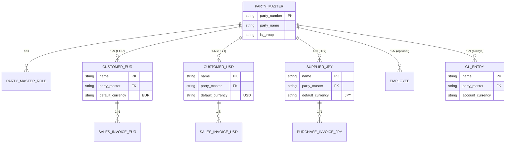

Architecture Deep-Dive
1 Entity Relationship

```mermaid
erDiagram
    PARTY_MASTER ||--o{ PARTY_MASTER_ROLE : "has"
    PARTY_MASTER ||--o{ CUSTOMER_EUR : "1-N (EUR)"
    PARTY_MASTER ||--o{ CUSTOMER_USD : "1-N (USD)"
    PARTY_MASTER ||--o{ SUPPLIER_JPY : "1-N (JPY)"
    PARTY_MASTER ||--o{ EMPLOYEE : "1-N (optional)"
    PARTY_MASTER ||--o{ GL_ENTRY : "1-N (always)"

    CUSTOMER_EUR ||--o{ SALES_INVOICE_EUR : "1-N"
    CUSTOMER_USD ||--o{ SALES_INVOICE_USD : "1-N"
    SUPPLIER_JPY ||--o{ PURCHASE_INVOICE_JPY : "1-N"

    PARTY_MASTER {
        string party_number PK
        string party_name
        string is_group
    }
    CUSTOMER_EUR {
        string name PK
        string party_master FK
        string default_currency "EUR"
    }
    CUSTOMER_USD {
        string name PK
        string party_master FK
        string default_currency "USD"
    }
    SUPPLIER_JPY {
        string name PK
        string party_master FK
        string default_currency "JPY"
    }
    GL_ENTRY {
        string name PK
        string party_master FK
        string account_currency
    }
```
